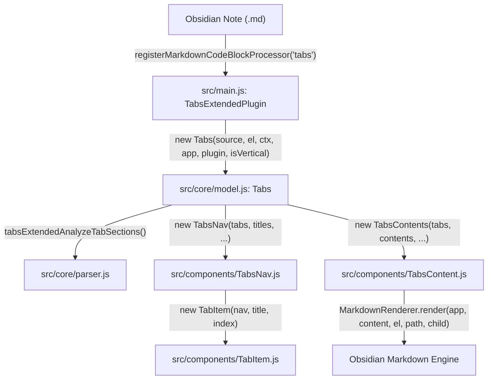
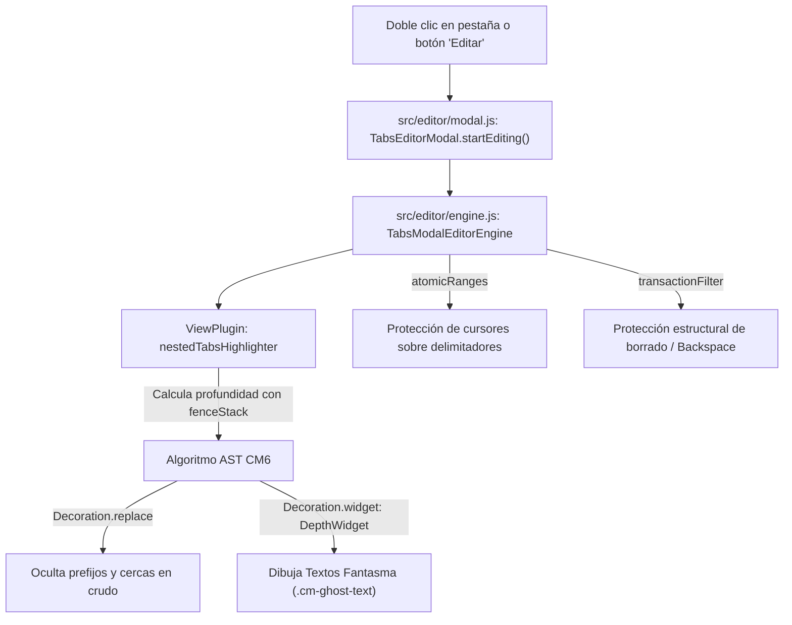

# Arquitectura Modular y Guía Técnica de Funciones (Tabs Extended)

Este documento detalla de manera exhaustiva la arquitectura modular de **Tabs Extended**, especificando qué módulo y qué funciones se encargan del **renderizado**, el **ciclo de vida de las pestañas**, los **textos fantasma (*ghost text*)**, las **decoraciones de CodeMirror 6**, y la **persistencia atómica** en Obsidian.

---

## 🌳 Árbol Estructural de Módulos (ASCII Tree)

```text
tabs-extended/
├── src/
│   ├── main.js                              # Punto de entrada y registro de CodeBlockProcessors
│   │
│   ├── i18n/                                # Sistema de internacionalización
│   │   ├── index.js                         # Motor de traducción ($ / _ / t)
│   │   └── locales/
│   │       ├── es.js                        # Diccionario en Español (Primario)
│   │       └── en.js                        # Diccionario en Inglés (Fallback)
│   │
│   ├── settings/                            # Panel de configuración y opciones
│   │   ├── defaultSettings.js               # Objeto DEFAULT_SETTINGS con valores iniciales
│   │   ├── SampleTabsPreview.js             # Previsualización interactiva SettingsSampleTabs
│   │   └── SettingTab.js                    # Panel UI TabsExtendedSettingTab
│   │
│   ├── core/                                # Núcleo del modelo de datos y ciclo de vida
│   │   ├── parser.js                        # Análisis AST de cercas, separadores y hashes
│   │   ├── config.js                        # Parser de configuración YAML/inline (TabsConfig)
│   │   └── model.js                         # Modelo reactivo MarkdownRenderChild (Tabs)
│   │
│   ├── components/                          # Componentes DOM de la interfaz de pestañas
│   │   ├── TabItem.js                       # Elemento individual de navegación (TabItem)
│   │   ├── TabContextMenu.js                # Menú contextual de clic derecho (TabContextMenu)
│   │   ├── TabsNav.js                       # Barra de navegación y drag & drop (TabsNav)
│   │   └── TabsContent.js                   # Contenedor y renderizado Markdown (TabsContents)
│   │
│   ├── editor/                              # Motor del Editor Modal y resaltador CodeMirror 6
│   │   ├── modal.js                         # Diálogo flotante del editor (TabsEditorModal)
│   │   └── engine.js                        # Motor CM6 (TabsModalEditorEngine, DepthWidget, Highlighter)
│   │
│   ├── modals/                              # Diálogos y ventanas emergentes auxiliares
│   │   ├── ChangelogModal.js                # Modal con historial de versiones
│   │   ├── ConfirmDeleteModal.js            # Modal de confirmación de eliminación
│   │   └── RenameTabModal.js                # Modal para renombrar pestañas
│   │
│   ├── styles/                              # Inyección dinámica de reglas CSS
│   │   └── previewStyles.js                 # Generador de CSS para niveles 1 a 5+
│   │
│   └── vendor/                              # Dependencias empaquetadas
│       └── codemirror-bundle.js             # Runtime CM6, Lezer Markdown y SortableJS
│
├── dist/                                    # Bundle de producción generado por esbuild
│   ├── main.js                              # Código final compilado
│   ├── manifest.json                        # Manifiesto de metadatos de Obsidian
│   └── styles.css                           # Hoja de estilos principal
│
└── docs/                                    # Documentación técnica y registros
    ├── bug_log.md                           # Bug-Trace histórico en tablas Markdown
    ├── modules.md                           # Este documento (Arquitectura y funciones)
    └── seguridad.md                         # Auditoría y directrices de seguridad
```

---

## 🎨 1. Módulos y Funciones de Renderizado en Obsidian

El renderizado de bloques de pestañas en la vista de lectura y vista previa de Obsidian sigue un flujo desacoplado y reactivo estructurado en `src/main.js`, `src/core/model.js` y `src/components/`.



### 1.1. `src/main.js` (Punto de Entrada del Render)
- **`registerMarkdownCodeBlockProcessor(kw, processor)`**:
  - Registra los procesadores de bloques para las palabras clave configuradas (`tabs`, `tabs-v`, etc.).
  - Instancia la clase `Tabs` pasando el texto fuente (`source`), el elemento contenedor (`el`), el contexto de posprocesado (`ctx`), la instancia de `App`, la referencia del plugin y el flag `isVertical`.
  - Vincula la instancia como hijo del ciclo de vida de Obsidian mediante `ctx.addChild(tabsInstance)`.

### 1.2. `src/core/model.js` (`Tabs` extiende `MarkdownRenderChild`)
- **`constructor(t, e, i, n, r, isVertical)`**:
  - Inicializa la estructura del bloque, resuelve el contenedor de pestañas (`outertabs` vs `innertabs`), vincula `sectionInfo` y lee la fuente original con `readOuterSourceBody()`.
- **`readOuterSourceBody()` & `findOuterClosingLine(editor, expectedRawText)`**:
  - Lee directamente el cuerpo fuente del bloque desde el editor de Obsidian en $O(1)$ validando primero `sectionInfo.lineEnd`, con fallback a escaneo completo mediante `tabsExtendedNormalizeSource()`.
- **`parseTabs(source, defaultTitle, defaultContent)`**:
  - Invoca `tabsExtendedAnalyzeTabSections()` en `src/core/parser.js` para dividir la fuente en títulos y contenidos herméticos, ignorando separadores dentro de bloques de código internos.
- **`renderTitles(titles)`**:
  - Instancia `TabsNav` (`src/components/TabsNav.js`) y monta la barra de navegación en el DOM.
- **`renderContents(contents)`**:
  - Instancia `TabsContents` (`src/components/TabsContent.js`) y monta los contenedores de contenido Markdown.
- **`setActiveTab(tabIndex)`**:
  - Cambia la pestaña activa, actualiza las clases CSS `.is-active`, almacena el índice en la caché `lastTabsCache` y preserva la posición de scroll del usuario.
- **`persistRawTextUpdate(nextRawText, nextActiveIndex)` & `writeRootRawText(rootTabs, nextRawText)`**:
  - Aplica actualizaciones atómicas sobre el archivo de Obsidian (`view.editor.replaceRange`) asegurando consistencia dimensional entre líneas antes y después del reemplazo.

### 1.3. `src/components/TabsNav.js` (`TabsNav`)
- **`initTabsNav()`**:
  - Construye el elemento contenedor `.tabs-extended-nav` (o `.tabs-extended-nav-vertical`).
  - Instancia los elementos de navegación individuales `TabItem`.
  - Configura **SortableJS** para permitir el arrastre (*Drag & Drop*) y reordenación de pestañas cuando `settings.dragAndDrop` está habilitado.
  - Inyecta el botón de acción rápida (`+` para añadir pestaña o lápiz para editar).

### 1.4. `src/components/TabItem.js` (`TabItem`)
- **`initTabItem()`**:
  - Genera el nodo DOM `.tabs-extended-nav-item` con accesibilidad ARIA (`role="tab"`, `aria-selected`).
  - Registra eventos de interacción:
    - `click`: Invoca `tabs.setActiveTab(index)`.
    - `contextmenu`: Despliega el menú contextual `TabContextMenu`.
    - `dblclick`: Abre el editor modal si `doubleClickToEdit` está activo.

### 1.5. `src/components/TabsContent.js` (`TabsContents` / `TabContentItem`)
- **`initTabsContents()`**:
  - Construye el contenedor `.tabs-extended-contents` y las divisiones individuales `.tabs-extended-tabcontent`.
- **`renderContent(content, containerEl)`**:
  - Invoca `MarkdownRenderer.render(this.app, content, containerEl, sourcePath, this.tabs)` delegando en Obsidian el renderizado completo de sintaxis Markdown, callouts, diagramas Mermaid, tablas, incrustaciones de imágenes y **bloques de pestañas anidados (`innertabs`)**.

---

## 👻 2. Módulos y Funciones de Textos Fantasma (*Ghost Text*) y Editor Modal

El editor modal avanzado de pestañas se implementa en `src/editor/modal.js` y `src/editor/engine.js` sobre la arquitectura **CodeMirror 6 (CM6)**.



### 2.1. `src/editor/modal.js` (`TabsEditorModal` extiende `Modal`)
- **`startEditing(tabsInstance)`**:
  - Extrae la sección fuente de la pestaña actual mediante `tabsInstance.getTabSourceSection(currentIndex)`.
  - Inyecta en el elemento modal (`modalEl`) las variables CSS dinámicas correspondientes a los colores temáticos de cada nivel de profundidad (`--nested-tab-color-level-0` a `--nested-tab-color-level-5plus`, `--nested-tab-delimiter-text-start`, etc.).
  - Instancia `TabsModalEditorEngine` en el contenedor `contentEl` y despliega el diálogo modal.
- **`onClose()` & `saveEditorData()`**:
  - Detecta si el texto del editor ha cambiado respecto a `initialEditorText`.
  - Ejecuta `this.tabs.replaceTabSourceSection(this.tabs.currentIndex, editorText)` para propagar los cambios al documento principal de Obsidian de manera segura.

### 2.2. `src/editor/engine.js` (`TabsModalEditorEngine`)

#### A. Clase `DepthWidget` (`WidgetType` de CodeMirror 6)
- **Ubicación**: `src/editor/engine.js`.
- **Propósito**: Widget gráfico DOM inyectado en el flujo de texto de CodeMirror 6 para renderizar **textos fantasma (*ghost text*)**, insignias de profundidad (*depth badges*), y marcadores de apertura/cierre de cercas sin alterar los caracteres reales del documento.
- **Firma del Constructor**:
  ```javascript
  new DepthWidget(type, text, view, lineNo, prefix, splitStr, depth)
  ```
  - `type`: Tipo de elemento (`"open"`, `"close"`, `"topic"`, `"main topic"`).
  - `text`: Texto del título o nombre de la pestaña.
  - `depth`: Nivel de anidación (0 para nivel superior, 1..5+ para bloques anidados).
- **Métodos Clave**:
  - **`toDOM(view)`**: Construye el nodo DOM seguro utilizando `createSpan()` y `createDiv()` (sin `innerHTML` dinámico para prevenir vulnerabilidades XSS), asignando clases `.cm-ghost-text`, `.cm-depth-marker`, `.depth-widget-main-topic` y aplicando los estilos de color de profundidad correspondientes.
  - **`eq(other)`**: Compara si dos instancias del widget son idénticas en tipo, texto, línea y profundidad para evitar repintados innecesarios en el DOM de CM6.
  - **`updateDOM(dom, view)`**: Permite a CodeMirror 6 actualizar las propiedades del elemento existente *in-place* sin destruirlo ni recrearlo.

#### B. Plugin de Resaltado `nestedTabsHighlighter` (`ViewPlugin` / `MatchDecorator`)
- **Ubicación**: `src/editor/engine.js`.
- **Propósito**: Analiza línea por línea el documento en el editor modal, rastreando la pila de cercas (`fenceStack`) y generando el conjunto de decoraciones visuales (`DecorationSet`).
- **Lógica y Algoritmo**:
  1. Recorre las líneas visibles o el documento completo evaluando aperturas (`~~~tabs`) y cierres (`~~~`).
  2. Calcula la variable `depth` (profundidad de anidación actual).
  3. **Ocultación visual (`Decoration.replace`)**: Reemplaza visualmente los caracteres crudos del separador (ej. `tema:`) o las virgulillas (`~~~tabs`) para que no se muestren como texto plano sucio.
  4. **Inyección de Texto Fantasma (`Decoration.widget`)**: Coloca una instancia de `DepthWidget` en el rango exacto, mostrando el marcador temático coloreado con su insignia de nivel (ej. `[Pestaña Principal]` o `[Nivel 2: tabs]`).

#### C. Rangos Atómicos (`atomicRanges`)
- **Ubicación**: `src/editor/engine.js`.
- **Propósito**: Define rangos de caracteres atómicos (`EditorView.atomicRanges.of(...)`) sobre los delimitadores protegidos (`~~~tabs`, `~~~`, `tema:`).
- **Efecto**: Impide que el cursor de texto del usuario se posicione en medio de los caracteres de control de una cerca, obligando al cursor a saltar la estructura completa como si fuera un único carácter indivisible.

#### D. Filtro de Transacciones (`transactionFilter`) y Protección Estructural
- **Ubicación**: `src/editor/engine.js`.
- **Propósito**: Intercepta cualquier transacción de entrada del usuario (`userEvent: "delete"`, `"input"`, etc.).
- **Funciones de Soporte**:
  - **`insertSingleLineBreak(view)`**: Controla la inserción limpia de saltos de línea al presionar `Enter` en títulos o bloques protegidos.
  - **`protectStructuralBackspace(view)`**: Bloquea el borrado con `Backspace` o `Delete` si la selección toca directamente una línea de cerca protegida, evitando la corrupción accidental de la sintaxis del bloque.

---

## ⚙️ 3. Módulos de Análisis Sintáctico y Utilidades

### 3.1. `src/core/parser.js`
- **`tabsExtendedAnalyzeTabSections(rawText, split, settings)`**:
  - Función pura de análisis sintáctico. Segmenta el texto fuente en secciones `{ from, to, separatorFrom, separatorTo, contentFrom }`, identificando líneas de separador con soporte de sangría (`trimStart()`) y excluyendo separadores dentro de tablas Markdown o bloques de código internos.
- **`tabsExtendedJoinTabSections(prefix, sections, originalSource)`**:
  - Reensambla limpiamente el texto fuente de las pestañas uniendo las secciones con saltos de línea consistentes.
- **`tabsExtendedFindDirectNestedBlocks(source, settings)`**:
  - Localiza únicamente los bloques anidados directos de primer nivel dentro del contenido de una pestaña, aislando bloques de código ordinarios.
- **`tabsExtendedNormalizeSource(text)`**:
  - Normaliza finales de línea (`\r\n` $\to$ `\n`) y recorta espacios en blanco residuales para comparaciones estrictas de contenido inmutable.

### 3.2. `src/components/TabContextMenu.js`
- **`TabContextMenu`**:
  - Menú contextual de clic derecho que encapsula las acciones:
    - *Añadir nueva pestaña*: Invoca `updateBlockWithNewTab()`.
    - *Renombrar pestaña*: Abre `RenameTabModal` y ejecuta `renameTabBySourceSection()`.
    - *Eliminar pestaña*: Abre `ConfirmDeleteModal` y ejecuta `removeTabFromBlock()`.
    - *Copiar / Pegar pestaña*: Transfiere el contenido de la sección a través de la API `navigator.clipboard`.

### 3.3. `src/styles/previewStyles.js`
- **`injectPreviewStyles(settings)`**:
  - Construye dinámicamente el elemento `<style id="tabs-extended-preview-styles">` en el `<head>` del DOM, generando las reglas CSS para los colores de acento, bordes, fondos e indicadores de los niveles de profundidad 0 a 5+.
