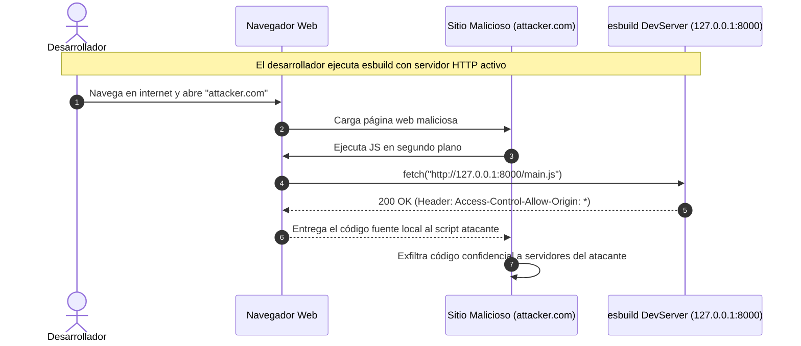

# 🛡️ Manual de Seguridad y Gestión de Vulnerabilidades: Tabs Extended

---

## 🎯 Propósito y Alcance de este Documento

Este documento constituye la **guía oficial de seguridad, auditoría de dependencias y mitigación de vulnerabilidades** del plugin **Tabs Extended**.

Su propósito es:
1. **Documentar y explicar detalladamente** las alertas de seguridad emitidas por sistemas automáticos de análisis como **GitHub Dependabot** y **npm audit**.
2. **Explicar de forma pedagógica y técnica** el origen, funcionamiento y vectores de ataque de cada vulnerabilidad reportada.
3. **Evaluar el impacto real** en el entorno de desarrollo y en los usuarios finales de Obsidian.
4. **Establecer las directrices de resolución y buenas prácticas de seguridad** para el mantenimiento del ciclo de vida del software.

---

## 📑 Índice de Contenidos

- [1. ¿Qué es Dependabot y cómo funciona?](#1-qué-es-dependabot-y-cómo-funciona)
- [2. Análisis de la Alerta: GHSA-67mh-4wv8-2f99 (esbuild CORS / DevServer)](#2-análisis-de-la-alerta-ghsa-67mh-4wv8-2f99-esbuild-cors--devserver)
  - [2.1 Ficha Técnica de la Vulnerabilidad](#21-ficha-técnica-de-la-vulnerabilidad)
  - [2.2 ¿Qué significa CWE-346 (Origin Validation Error)?](#22-qué-significa-cwe-346-origin-validation-error)
  - [2.3 ¿Por qué ocurre esta vulnerabilidad en esbuild?](#23-por-qué-ocurre-esta-vulnerabilidad-en-esbuild)
  - [2.4 El Mecanismo CORS y Same-Origin Policy (SOP)](#24-el-mecanismo-cors-y-same-origin-policy-sop)
- [3. Escenario de Ataque Detallado (Proof of Concept Conceptual)](#3-escenario-de-ataque-detallado-proof-of-concept-conceptual)
- [4. Evaluación de Riesgo en Tabs Extended](#4-evaluación-de-riesgo-en-tabs-extended)
  - [4.1 ¿Afecta al usuario final en Obsidian?](#41-afecta-al-usuario-final-en-obsidian)
  - [4.2 ¿Afecta a nuestro entorno de desarrollo actual?](#42-afecta-a-nuestro-entorno-de-desarrollo-actual)
- [5. Procedimiento de Mitigación y Actualización](#5-procedimiento-de-mitigación-y-actualización)
  - [5.1 Actualización de esbuild a >= 0.25.0](#51-actualización-de-esbuild-a--0250)
  - [5.2 Verificación con npm audit y compilación](#52-verificación-con-npm-audit-y-compilación)
- [6. Guía de Buenas Prácticas de Seguridad para Obsidian Plugins](#6-guía-de-buenas-prácticas-de-seguridad-para-obsidian-plugins)
  - [6.1 Higiene de la Cadena de Suministro (Supply Chain Security)](#61-higiene-de-la-cadena-de-suministro-supply-chain-security)
  - [6.2 Prevención de Inyecciones y XSS en Markdown](#62-prevención-de-inyecciones-y-xss-en-markdown)
  - [6.3 Liberación Segura de Recursos en el Ciclo de Vida](#63-liberación-segura-de-recursos-en-el-ciclo-de-vida)

---

# 1. ¿Qué es Dependabot y cómo funciona?

**[GitHub Dependabot](https://docs.github.com/es/code-security/dependabot)** es un servicio de seguridad automatizado provisto por GitHub que escanea continuamente los manifiestos de dependencias (`package.json`, `package-lock.json`, etc.) de los repositorios.

### ¿Cómo opera Dependabot?
1. **Monitoreo de la Base de Datos de Asesorías de GitHub (GHSA)**: GitHub recopila y analiza alertas públicas (CVEs) de seguridad registradas en el ecosistema de código abierto.
2. **Cruce de Versiones**: Compara las versiones exactas instaladas en tu árbol de dependencias contra los rangos declarados como vulnerables.
3. **Generación de Alertas y Pull Requests**: Cuando detecta una versión comprometida, emite una notificación categorizada por severidad (Baja, Moderada, Alta, Crítica) y, opcionalmente, abre un Pull Request automático con el parche de actualización necesario.

---

# 2. Análisis de la Alerta: GHSA-67mh-4wv8-2f99 (esbuild CORS / DevServer)

## 2.1 Ficha Técnica de la Vulnerabilidad

| Atributo | Detalle |
| :--- | :--- |
| **Identificador GitHub** | [GHSA-67mh-4wv8-2f99](https://github.com/advisories/GHSA-67mh-4wv8-2f99) |
| **Título** | *esbuild enables any website to send any requests to the development server and read the response* |
| **Paquete Afectado** | `esbuild` (npm) |
| **Tipo de Dependencia** | Dependencia de desarrollo (`devDependencies`) |
| **Versiones Afectadas** | `<= 0.24.2` |
| **Versión Parcheada** | `>= 0.25.0` |
| **Severidad** | **Moderada** (CVSS v3: `5.3 / 10`) |
| **Vector CVSS** | `CVSS:3.1/AV:N/AC:H/PR:N/UI:R/S:U/C:H/I:N/A:N` |
| **Categoría CWE** | **CWE-346**: Origin Validation Error (Error de Validación de Origen) |

---

## 2.2 ¿Qué significa CWE-346 (Origin Validation Error)?

El estándar **CWE-346** hace referencia a fallos de software donde el sistema no valida o valida incorrectamente el origen (*Origin*) de una solicitud HTTP proveniente de un navegador web, permitiendo que un sitio web malicioso interactúe con servicios internos como si fuera legítimo.

---

## 2.3 ¿Por qué ocurre esta vulnerabilidad en esbuild?

`esbuild` no es solo un empaquetador; también incluye una API para levantar un **servidor web local de desarrollo** (`esbuild.serve()` o el flag de CLI `--servedir`), el cual permite recargar la aplicación en tiempo real mientras el programador edita código (*live reload* vía SSE - Server-Sent Events).

En las versiones `<= 0.24.2`, el servidor de desarrollo de `esbuild` respondía a todas las solicitudes HTTP agregando por defecto la siguiente cabecera:

```http
Access-Control-Allow-Origin: *
```

El comodín (`*`) le indica al navegador web que **cualquier sitio web de internet** tiene permiso explícito para leer los datos devueltos por ese servidor local.

---

## 2.4 El Mecanismo CORS y Same-Origin Policy (SOP)

### La Política del Mismo Origen (Same-Origin Policy - SOP)
Es la barrera de seguridad más importante de los navegadores web. Por defecto:
- Un script ejecutándose en `http://malicious.example.com` **NO** puede leer el contenido de una respuesta proveniente de `http://127.0.0.1:8000` (tu máquina local).
- Si el sitio malicioso intenta hacer un `fetch('http://127.0.0.1:8000/main.js')`, el navegador bloquea la lectura de la respuesta.

### El problema con `Access-Control-Allow-Origin: *`
Cuando el servidor local responde con `Access-Control-Allow-Origin: *`, el navegador interpreta: *"El servidor local permite que cualquier dominio lea su contenido"*. En consecuencia, **el navegador desactiva la protección SOP y entrega el archivo al script atacante**.

---

# 3. Escenario de Ataque Detallado (Proof of Concept Conceptual)

Un ataque real bajo esta vulnerabilidad requiere que se cumplan las siguientes condiciones:



### Pasos del Vector de Ataque:
1. **Servidor Activo**: El desarrollador tiene encendido el servidor de desarrollo de `esbuild` en su máquina (`http://127.0.0.1:8000`).
2. **Navegación**: El desarrollador visita una página web maliciosa o un enlace con código malicioso inyectado (`http://malicious.example.com`).
3. **Petición Local**: Un script en la página atacante ejecuta `fetch('http://127.0.0.1:8000/...')` hacia los puertos comunes de desarrollo local (`8000`, `3000`, `8080`).
4. **Exfiltración de Datos**: Debido a la cabecera permisiva de `esbuild`, el navegador entrega el archivo local al atacante, permitiéndole leer código fuente en desarrollo, configuraciones o variables transmitidas por el servidor de pruebas.

---

# 4. Evaluación de Riesgo en Tabs Extended

## 4.1 ¿Afecta al usuario final en Obsidian?
> [!NOTE]
> **Impacto en Usuarios Finales: CERO (0%)**

1. **Dependencia de Desarrollo**: `esbuild` es una herramienta que se ejecuta exclusivamente en la máquina del desarrollador durante el proceso de compilación (`npm run build`).
2. **No viaja en el paquete**: `esbuild` no forma parte del archivo final distribuido (`main.js`, `manifest.json`, `styles.css`). Los usuarios que descargan el plugin en Obsidian no descargan ni ejecutan `esbuild`.

---

## 4.2 ¿Afecta a nuestro entorno de desarrollo actual?
> [!NOTE]
> **Impacto en el Entorno de Desarrollo de Tabs Extended: NULO**

En nuestro archivo `esbuild.config.mjs`:
- Usamos el modo **compilación estática** y **observador de archivos a disco** (`context.watch()`).
- **No levantamos un servidor HTTP local en red** (`context.serve()`).
- Los archivos compilados se escriben directamente en disco (`dist/main.js` y `D:/PKM/.obsidian/plugins/tabs-extended/`).

A pesar de que el riesgo real en nuestro flujo es nulo, **es una práctica mandatoria en ingeniería de software mantener todas las dependencias en versiones sin vulnerabilidades conocidas**.

---

# 5. Procedimiento de Mitigación y Actualización

## 5.1 Actualización de esbuild a >= 0.25.0

La vulnerabilidad fue corregida oficialmente en la versión **`0.25.0`** de `esbuild` (y versiones posteriores como `0.25.12`).

Para actualizar la dependencia en el proyecto:

```bash
# Instalar la versión parcheada de esbuild como devDependency
npm install -D esbuild@^0.25.0
```

Esto actualiza:
1. `package.json`: La directiva `"esbuild": "^0.25.0"`.
2. `package-lock.json`: El árbol de resolución con el hash de integridad de la nueva versión.

---

## 5.2 Verificación con npm audit y compilación

Tras actualizar, ejecutamos las verificaciones estándar de seguridad y construcción:

```bash
# 1. Auditar vulnerabilidades en el árbol de dependencias
npm audit

# 2. Compilar el plugin para verificar compatibilidad total
npm run build
```

---

# 6. Guía de Buenas Prácticas de Seguridad para Obsidian Plugins

Para garantizar que **Tabs Extended** mantenga los más altos estándares de seguridad y confianza dentro de la comunidad de Obsidian, se aplican las siguientes directrices:

## 6.1 Higiene de la Cadena de Suministro (Supply Chain Security)
- Mantener las dependencias mínimas indispensables (`devDependencies` reducidas a herramientas esenciales de análisis y empaquetado como `esbuild` y `acorn`).
- Excluir dependencias pesadas del bundle final mediante la directiva `--external:obsidian`.

## 6.2 Prevención de Inyecciones y XSS en Markdown
- En lugar de inyectar cadenas HTML directamente mediante `innerHTML`, el plugin delega el procesamiento de contenido y títulos al motor nativo y sanitizado de Obsidian: **`MarkdownRenderer.render()`**.
- Todas las entradas de usuario (títulos de pestañas, prefijos de separación) son normalizadas y escapadas antes de evaluar expresiones regulares o construir nodos DOM.

## 6.3 Liberación Segura de Recursos en el Ciclo de Vida
- Todo evento global (`addEventListener`, `MutationObserver`, `requestAnimationFrame`) registrado por el plugin se desvincula de forma determinista en los métodos de desmontaje (`onunload()`, `Tabs.register()`, `onClose()`), evitando fugas de memoria (*memory leaks*) y listeners huérfanos que puedan degradar el rendimiento o interceptar eventos indebidos.